# Windows Env Installation Guide
11/07/23

Donald McLaughlin

# High Level Overview
1. Install build tools and remove python if installed already.
2. Install Chocolatey
3. Install packages
4. Clone the github repo
5. Run the project
   1. Consult the issues with running the project.
## Preliminary Steps
1. Uninstall Python if already installed.
   1. 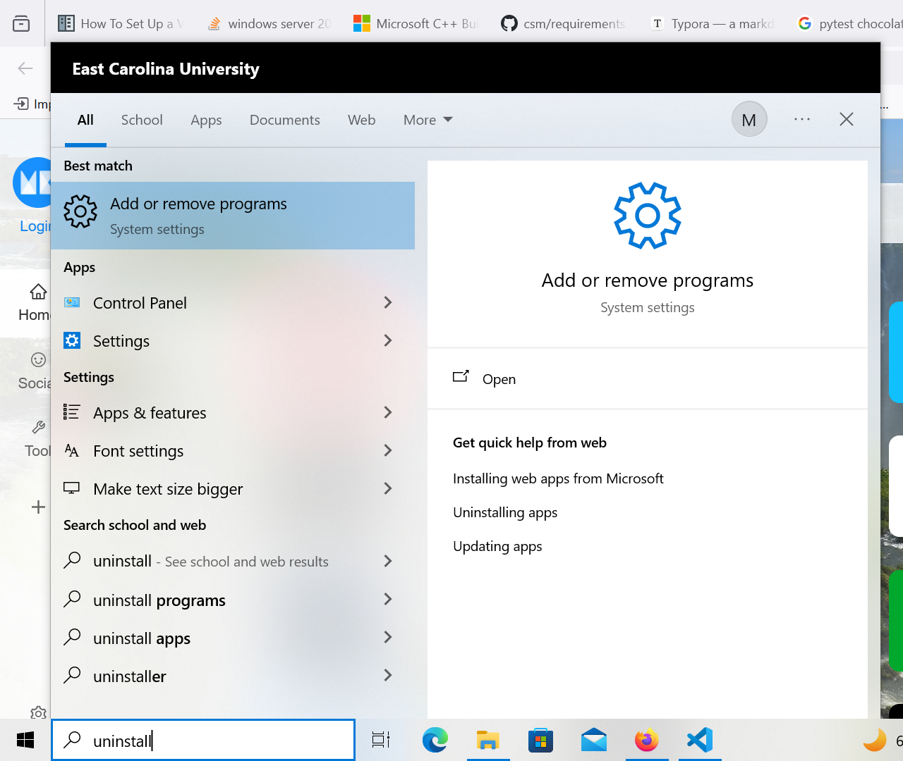
   2. 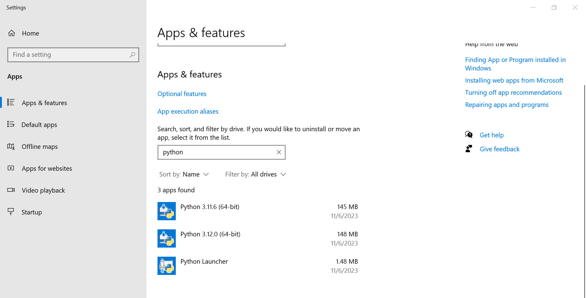
2. Install Microsoft build tools
[Visit CPP build Tools](https://visualstudio.microsoft.com/visual-cpp-build-tools/)
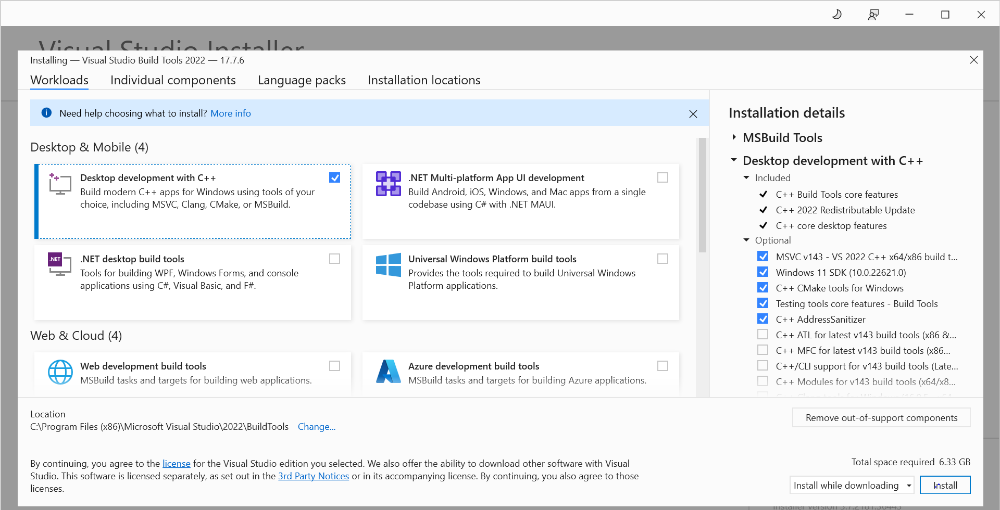
## Installing the package manager
1. Installing Chocolatey. Make sure the installation method is set to Individual if not already set.
[Visit Chocolatey website install page](https://chocolatey.org/install)

1. Installing Chocolatey via command
   * Simply paste the command from the install instructions into **powershell in administrative mode**.
   * 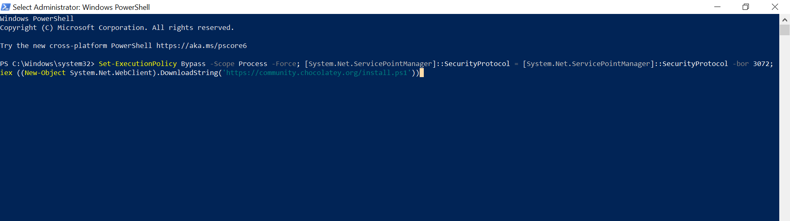
   * Sample output from install
   * 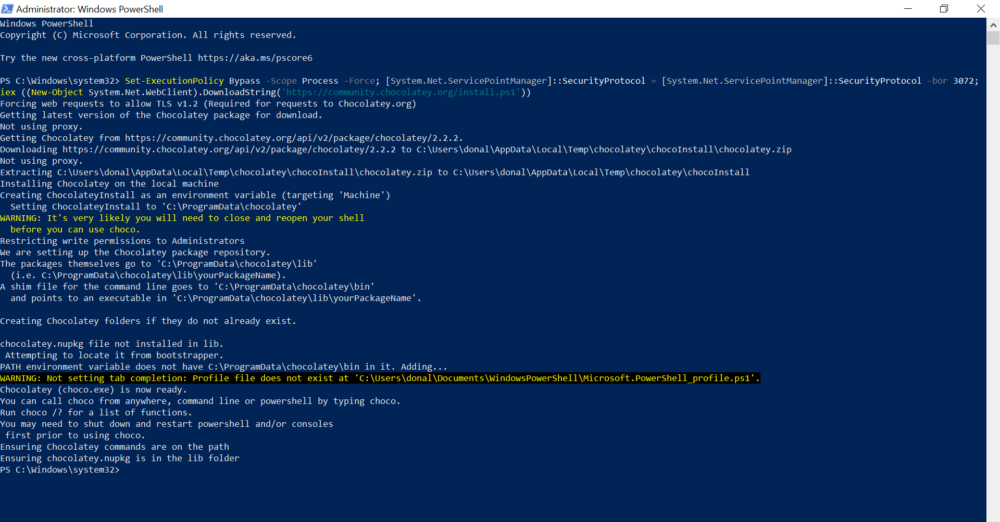
2. `choco -?`
   * 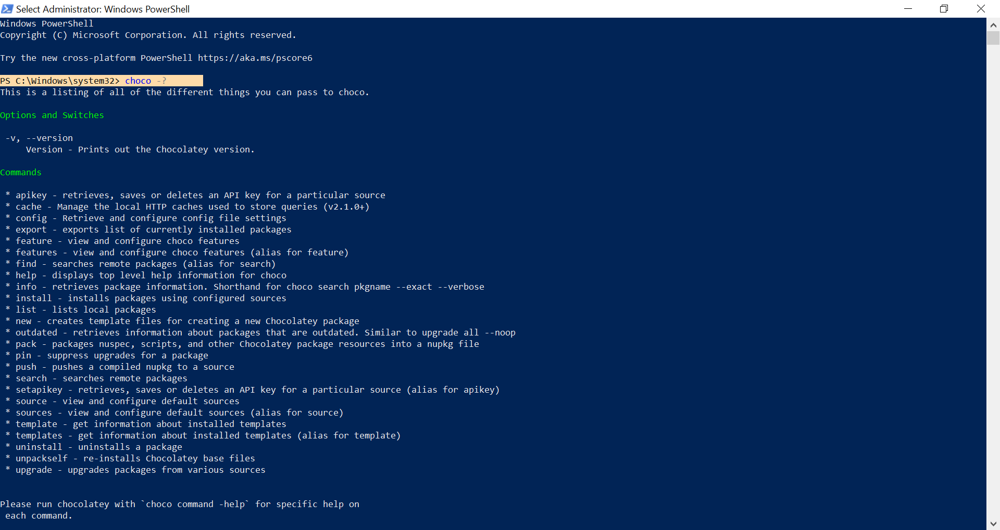 
## Using the package manager
This section can be skipped until needed. Just providing some useful commands for using chocolatey and powershell.

[For a full list of commands consult the choco docs](https://docs.chocolatey.org/en-us/choco/commands/)
* `choco -?` Check version
* `choco list` Lists all choco packages
* `choco upgrade all` Upgrades all packages
* `choco uninstall <pkg-name>` uninstalls particular package

### Using Powershell
* `cd <dir name>` change directory also can use tab for autocomplete.
* `cd ..` go back a directory
* `cd \` go to root directory 
* `ls` list selection
* `mkdir <dir-name>` create a directory
* `Remove-Item <Directory> -Recurse -Force`  Removes a directory as well as its contents.
* `clear` Clears terminal output
* `pwd` display current directory

## Installing our packages
Alright, so now we have our package manager and know a couple of commands to use it. Lets get to the actual real use of package managers that being installing packages. 

The syntrax for installing packages is `choco install <package name>`

### Install python
`choco install python311`
Enter Y for any prompt asking to do so for the scripts that chocolatey says.
### Install git
`choco install git -y`
As you can see we added -y to the end of this command. This allows us to automatically run the install and running of the scripts instead of manually entering Y.
### Install venv
`choco install python3-virtualenv -y`
## Installing our Github Project
Now we have the software to finally install and run our project. Next we need to clone our repo.

1. For organizational purposes lets make a new directory to store our Cloned repos.
   1. If you want to do all of this in the terminal then simply open up a new powershell instance and use `mkdir Clones`. This will create a Clones directory in your \Users directory. Then simply `cd Clones` and you should be good to do the next step.
    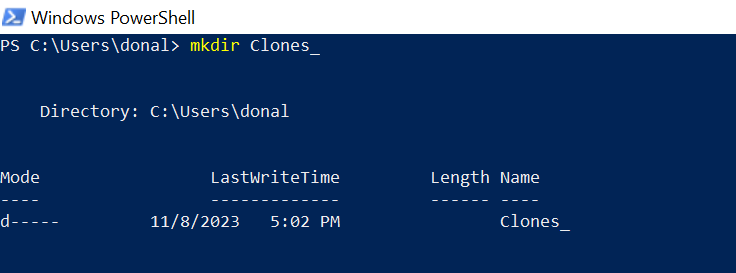
2. Run the command in the directory you wish to store your repos `git clone https://github.com/don1997/csm.git`
3. Now cd into our newly cloned repo. 
4. Run the command `git checkout v0.5.0` to switch our dev branch.
5. Use `git branch` to verify that you are on the correct branch.
## Setting up our Github Project
Alright so now we have our package manager, packages, and even our project. Next we need to run the project. Unfortunately there is a little bit to do since going from Linux->Windows wasn't as straightforward as i thought. 

The process for the intitiall build and run of the application is :
1. Activate Venv
2. install the requirements.txt
3. Run the app using `flask run`
4. Open a browser with the local host url.

But first lets do some setting up since we need to change some stuff around otherwise we will encounter errors.
### Venv
First lets start up our venv. 
1. cd into project if you haven't done so.
2. run the command `python -m venv venv`
* 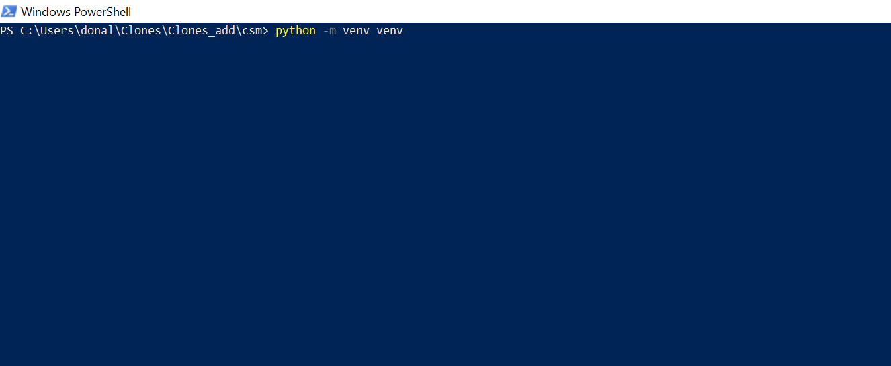
* After running it. In the root directory of the project. You should see a venv folder.
* 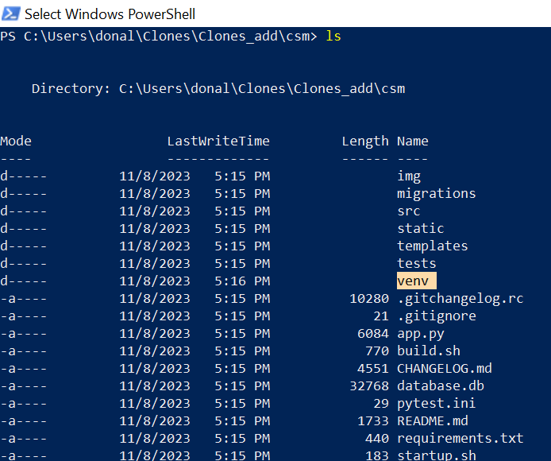
1. Next all we have to do is activate the virtual environment with `venv\Scripts\Activate.ps1` 
2. But this results in an error.
* 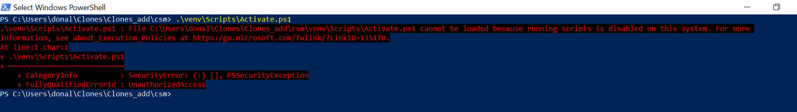
### Bypass Error 
To bypass this we need to go back to an administrator mode powershell. And paste the following: `Set-ExecutionPolicy RemoteSigned`
This will allow us to run scripts. Note when you are finished with your session make sure to reopen a admin powershell and paste `Set-ExecutionPolicy Restricted` To set your system back to a restricted state to protect it. 

After that run the command script `venv\Scripts\Activate.ps1` and you should see (venv) next to your alias like so.
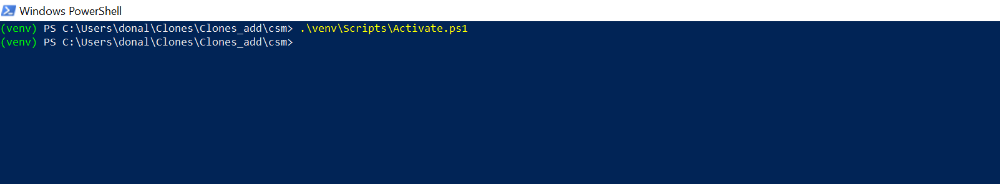
Now we have our virtual env.
### Fix Greenlet 
Now we just have to install requirements.txt and run the app. But, we have one more thing we need to do. Greenlet which is a dependency for our app in the requirements.txt file does not play nice when building our depenedencies. To fix this simply remove the line containing Greenlet in our requirements.txt.

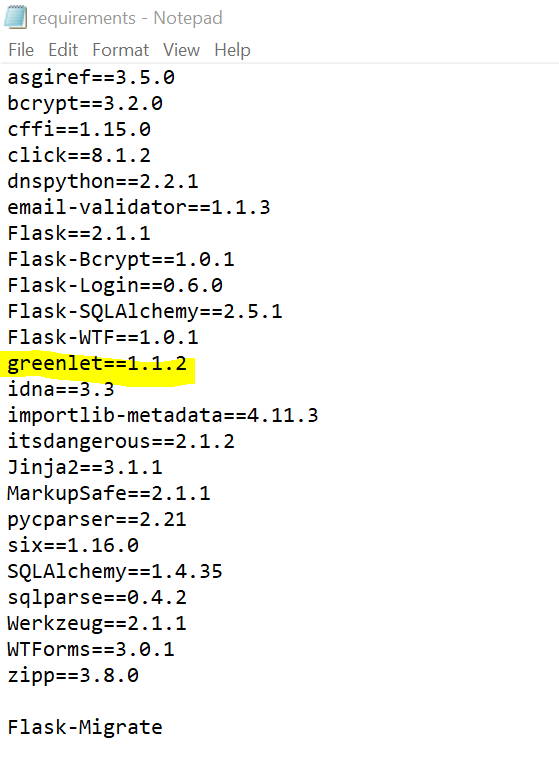

Delete greenlet and then save the file.

Now we are ready to install our dependencies and finally run the app!

1. `pip install -r .\requirements.txt` into the root dir of the project. 
2. simply run the command and you will see all of our dependencies build.
3. 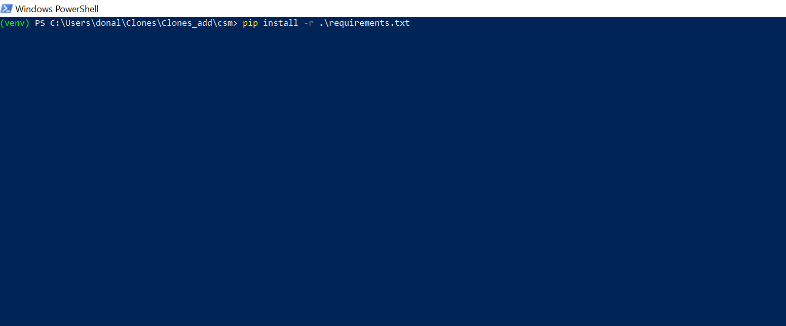
4. After the project is done building you should be set to run it!
## Running our Github Project
Simply enter `flask run` into the root dir of the project.

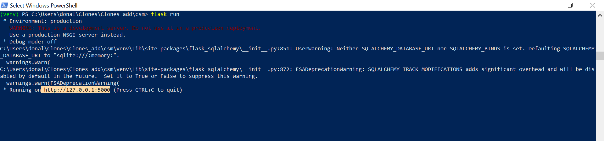

And paste the url into a browser.

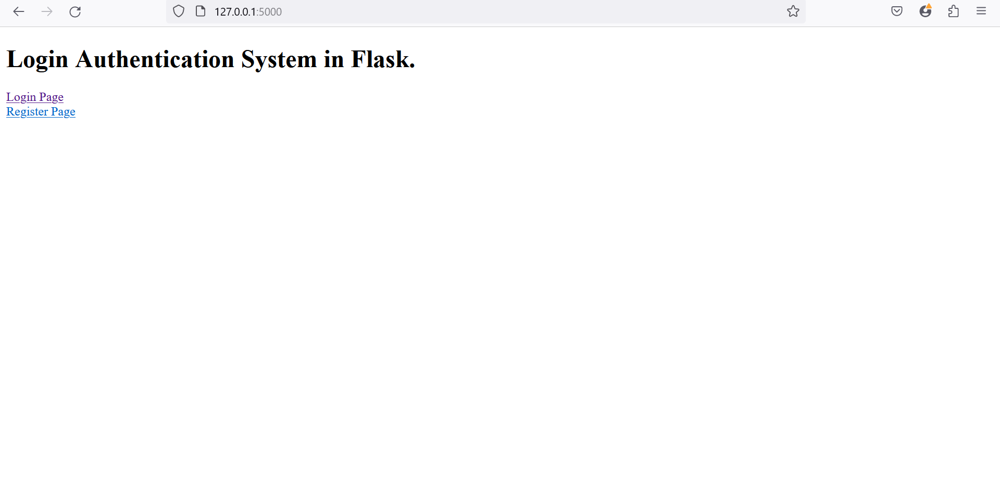
And there you have it the login screen for the app. If you want to test it the test account is username: test password: password.

When finished `deactivate` your venv. If you wish to run the app again simply activate the venv script `venv\Scripts\Activate.ps1` and hit `flask run`

---
## Final Notes

v 1.0.0
